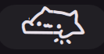

# Bongo Cat

Watch the cat tap its paws as you type!



## Requirements

- `evtest` - For monitoring specific keyboard events.
- `libinput` **CLI** - For **"All Keyboards"** mode.
- **Input group** - User must be in the `input` group: `sudo usermod -aG input $USER`.

> [!NOTE]
> On many distros, the libinput CLI is in a separate package: `libinput-tools` (Arch/Debian/Ubuntu) or `libinput-utils` (Fedora). Logout and back in after adding your user to the input group.

If a requirement is missing, the cat shows a warning badge with setup instructions.

## Install

Use the DMS CLI:
```bash
dms plugins install bongoCat
```

Or manually:
```bash
git clone https://github.com/hthienloc/dms-bongo-cat ~/.config/DankMaterialShell/plugins/bongoCat
```

## Features

- **Real-time typing** - Cat reacts to your keyboard input.
- **Blink & sleep** - Blinks when active, sleeps after inactivity.
- **Adjustable size** - Customize from 50% to 200%.
- **Cat color** - Keep classic black & white, follow your theme's accent, or pick a custom color.
- **Mouse interaction (optional)** - Paws react to clicks and scrolling (enable in settings).
- **Typing metrics (optional)** - Live WPM and accuracy tracking with a privacy-first approach.
- **Key sounds (optional)** - Soft click as you type, with adjustable volume.

## Usage

| Action | Result |
|--------|--------|
| Left click | Open settings |
| Right click | Toggle sleep mode |

### Keyboard Selection
Select a specific keyboard in settings to filter input. If a non-keyboard device appears in the list, please **open an issue**.

## Roadmap / TODO

- [x] **Improved Key-Hold Logic:** Refine input polling for sustained key presses.
- [x] **Mouse Interaction:** Animate paws reacting to clicks and scrolling.
- [x] **Performance Metrics (WPM):** Live typing speed and correction rate.
- [ ] **Extended Skin Library:** Support for custom skins and cat variants.

## Credits

- **[@StrayRogue](https://x.com/StrayRogue)** — Creator of the original Bongo Cat artwork used by the bongocat widget
- **[BongoCat](https://github.com/ayangweb/BongoCat)** — Desktop implementation reference

## License

MIT
